# **User Manual V.3**

## **Introduction**

**ชื่อระบบ** : Research Document Management System  

**ลักษณะ** : เป็นระบบสำหรับจัดการงานวิจัยของวิทยาลัยการคอมพิวเตอร์  

**เวอร์ชัน** : 3  

**วัตถุประสงค์ของคู่มือ** : อธิบายวิธีการใช้งานระบบจัดการไฮไลท์บนหน้าเว็บ เพื่อให้ผู้ใช้สามารถเพิ่ม แก้ไข หรือจัดการไฮไลต์ที่โชว์บนหน้า Home และไฮไลต์ที่โชว์บนหน้า Highlights ได้อย่างมีประสิทธิภาพ  

**กลุ่มเป้าหมาย** : Administrative staff, Visitors  

---

## **How to Use**

### **1. Visitors**

1. เปิดเว็บเบราว์เซอร์ที่ต้องการใช้งาน  
2. ไปที่ URL : <https://cs04sec267.cpkkuhost.com/> เพื่อเข้าใช้งานระบบ  

   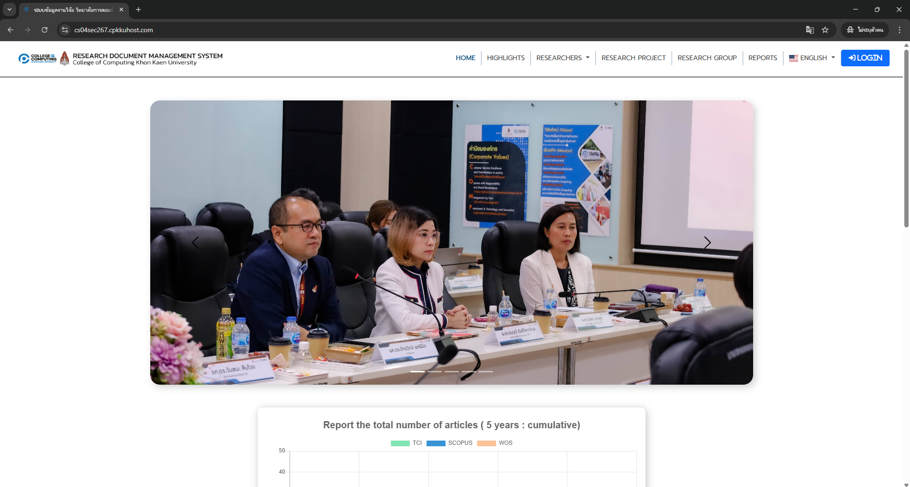

3. คลิกที่ไฮไลต์บนหน้า Home เพื่อดูรายละเอียดของไฮไลต์  

   

4. คลิกที่เมนู **Highlights** บน Navigation Bar (แถบนำทาง) เพื่อดูไฮไลต์ทั้งหมด  

   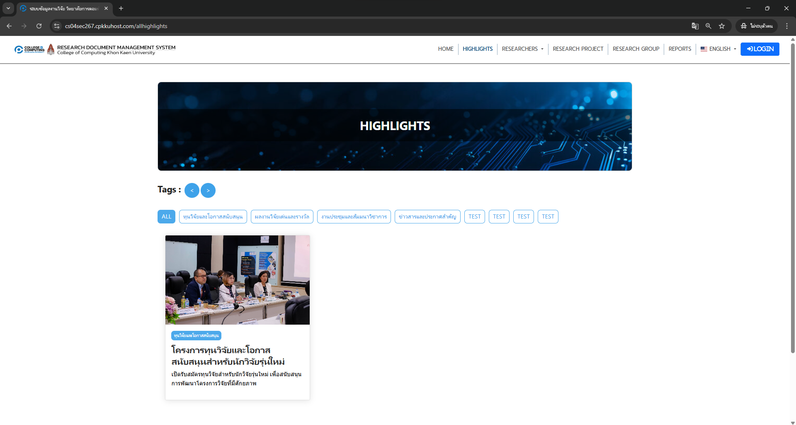

5. คลิกที่ Tags เพื่อเลือกดูเฉพาะ Highlight ที่เกี่ยวข้องกับ Tag นั้น  

   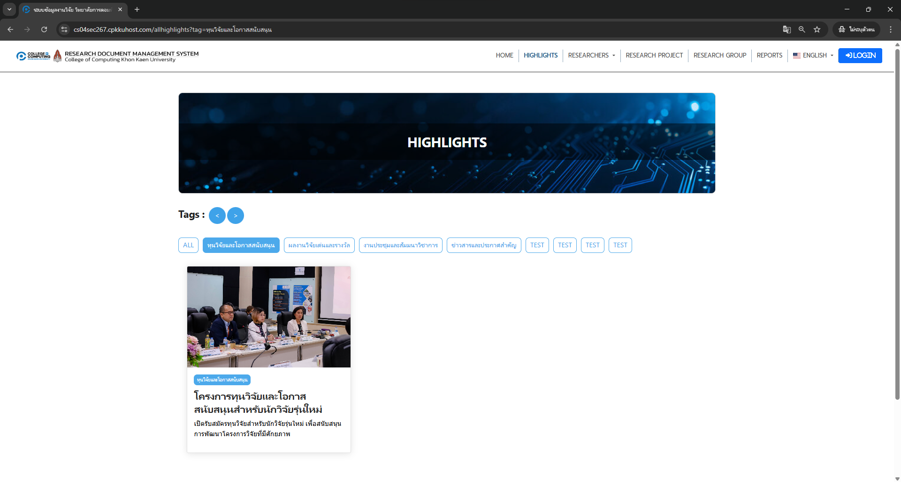

---

### **2. Administrative staff**

1. เปิดเว็บเบราว์เซอร์ที่ต้องการใช้งาน  
2. ไปที่ URL : <https://cs04sec267.cpkkuhost.com/> เพื่อเข้าใช้งานระบบ  

   

3. คลิกที่ปุ่ม **LOGIN** หรือไปที่ URL : <https://cs04sec267.cpkkuhost.com/login>  

   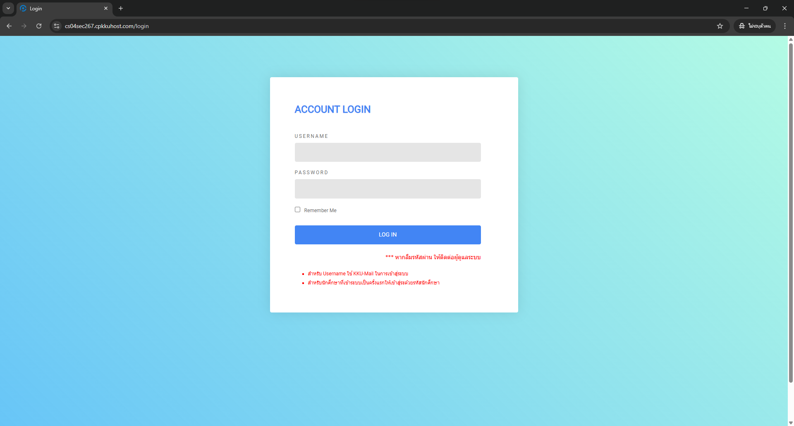

4. กรอก **Username** และ **Password** เพื่อเข้าสู่ระบบ จากนั้นคลิกปุ่ม **LOG IN**  

   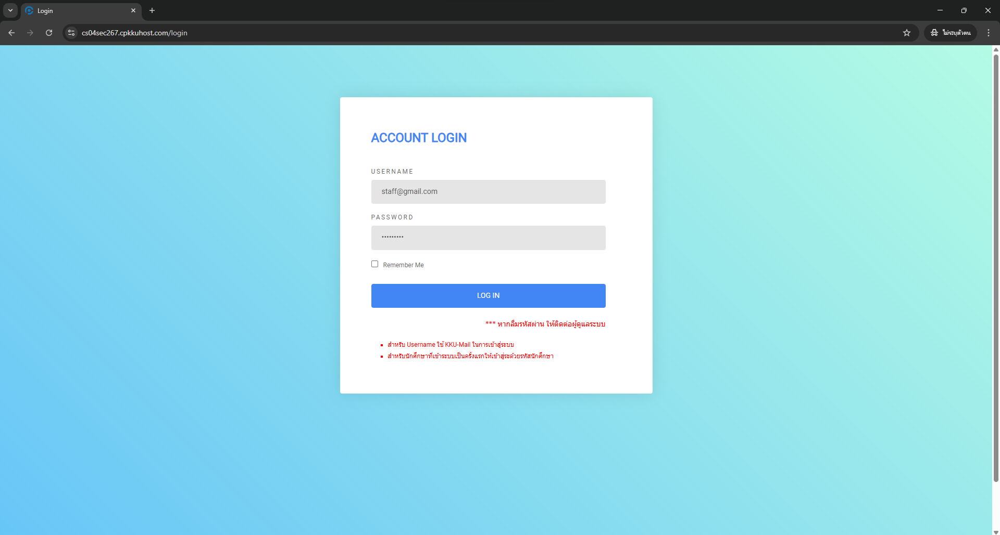

5. เมื่อเข้าสู่ระบบแล้ว ผู้ใช้จะอยู่ที่หน้า **Dashboard**  

   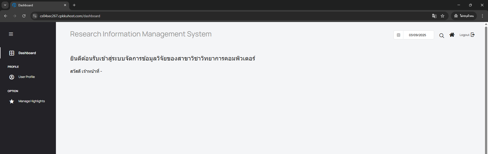

6. คลิกไปที่เมนู **Manage Highlights** เพื่อจัดการไฮไลต์ของเว็บไซต์  

   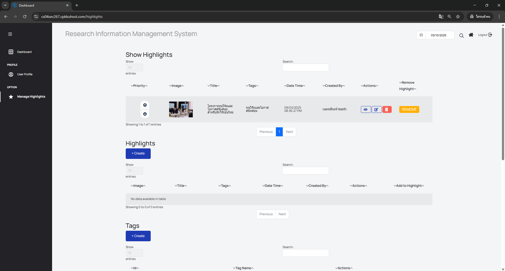

---

## **Manage Highlights**

### **1. การเพิ่ม Highlight**

1. คลิกปุ่ม **+Create** ใต้ **Highlights** เพื่อสร้างไฮไลต์ใหม่  

   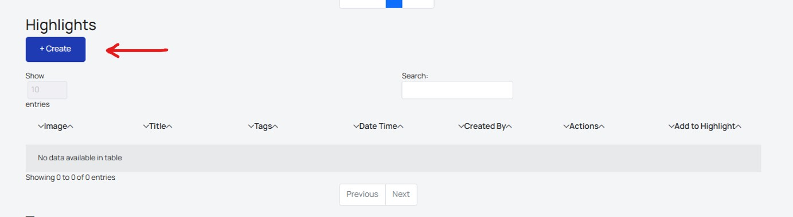

2. เมื่ออยู่ที่หน้า **Create Highlight** จะให้กรอกข้อมูล ได้แก่  

   - **Cover Image** (ภาพปก อัปโหลดได้แค่ไฟล์นามสกุล .jpeg .png .jpg และ gif)  
   - **Title** (หัวข้อ)  
   - **Tags** (แท็ก สามารถเลือกได้มากกว่า 1 แท็ก และสามารถคลิกปุ่ม x แท็กที่เลือกเพื่อยกเลิกการเลือก)  
   - **Description** (คำอธิบาย)  
   - **Additional Link** (ลิงค์เพิ่มเติม)  
   - **Related Images** (ภาพที่เกี่ยวข้อง สามารถเลือกอัปโหลดได้พร้อมกันหลายภาพ และอัปโหลดได้แค่ไฟล์นามสกุล .jpeg .png .jpg และ gif และสามารถคลิกปุ่ม x เพื่อยกเลิกการเลือกภาพนั้นได้ หรือ คลิกปุ่ม Clear All เพื่อยกเลิกการเลือกภาพทั้งหมด)  

3. คลิกปุ่ม **Save** เพื่อสร้างไฮไลต์ จากนั้น Highlight ที่สร้างเสร็จแล้วจะแสดงที่ตาราง Highlights  

   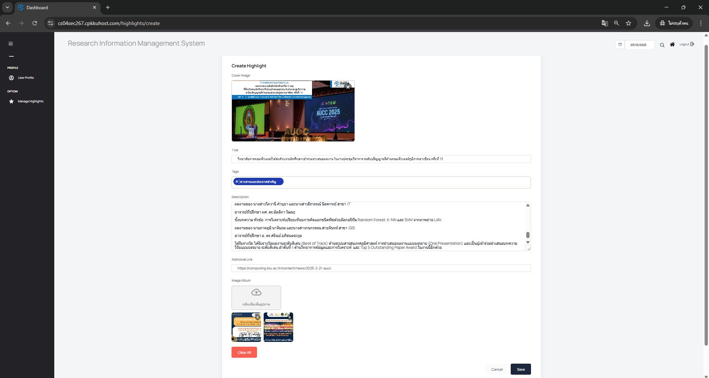

4. คลิกปุ่ม **View** (ดวงตา) ที่ช่อง Actions เพื่อดูรายละเอียดของไฮไลต์ได้  

   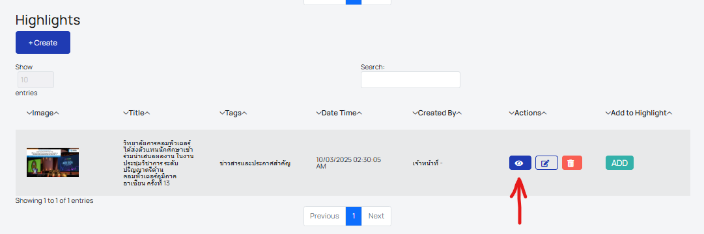  

   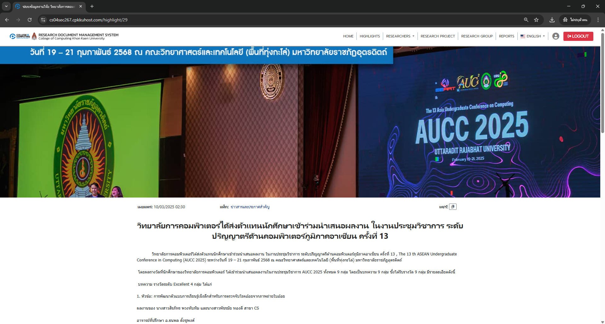

---

### **2. การแก้ไข Highlight**

1. คลิกปุ่ม **Edit** (ดินสอ) ที่ช่อง Actions ของไฮไลต์ที่ต้องการแก้ไข  

   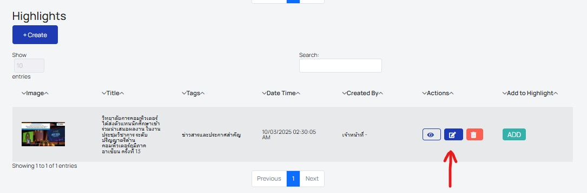

2. เมื่ออยู่ที่หน้า **Edit Highlight** จะสามารถแก้ไขข้อมูล ได้แก่  

   - **Cover Image** (ภาพปก อัปโหลดได้แค่ไฟล์นามสกุล .jpeg .png .jpg และ gif)  
   - **Title** (หัวข้อ)  
   - **Tags** (แท็ก สามารถเลือกได้มากกว่า 1 แท็ก และสามารถคลิกปุ่ม x แท็กที่เลือกเพื่อยกเลิกการเลือก)  
   - **Description** (คำอธิบาย)  
   - **Additional Link** (ลิงค์เพิ่มเติม)  
   - **Related Images** (ภาพที่เกี่ยวข้อง สามารถเลือกอัปโหลดได้พร้อมกันหลายภาพ และอัปโหลดได้แค่ไฟล์นามสกุล .jpeg .png .jpg และ gif และสามารถคลิกปุ่ม x เพื่อยกเลิกการเลือกภาพนั้นได้)  

3. คลิกปุ่ม **Update**  
4. คลิก "ยืนยันการอัปเดต" เพื่อเสร็จสิ้นการแก้ไขไฮไลต์  

   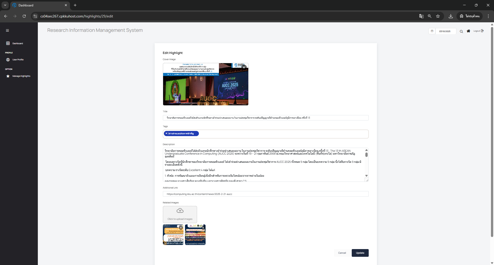

---

### **3. การลบ Highlight**

1. คลิกปุ่ม **Delete** (ถังขยะ) ที่ช่อง Actions ของไฮไลต์ที่ต้องการลบ  
2. คลิก "ยืนยันการลบ" เพื่อเสร็จสิ้นการลบไฮไลต์  

   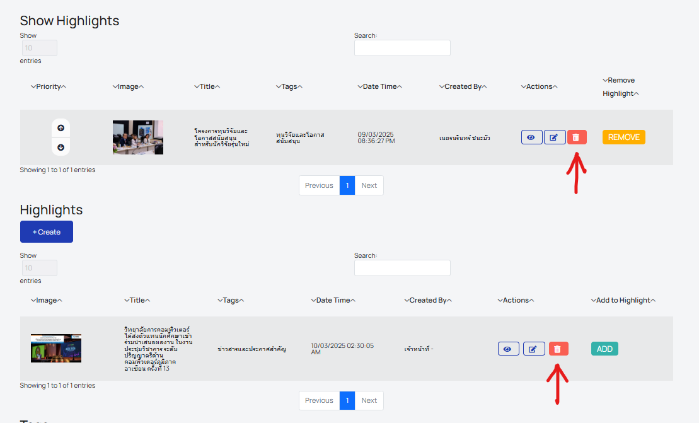

---

### **4. การนำ Highlight ขึ้นแสดงบนหน้า Home**

1. คลิกปุ่ม **ADD** ที่ช่อง Add to Highlight ของไฮไลต์บนตาราง Highlights ที่ต้องการนำไปแสดงบนหน้า Home  

   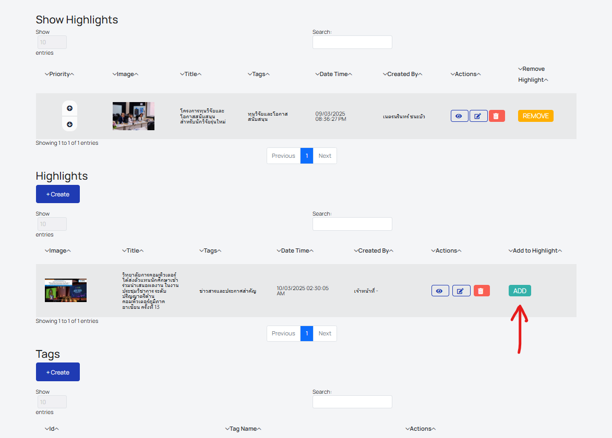

2. จากนั้นไฮไลต์นั้นจะย้ายจากตาราง Highlights ไปอยู่บนตาราง Show Highlights และแสดงบนหน้า Home  

   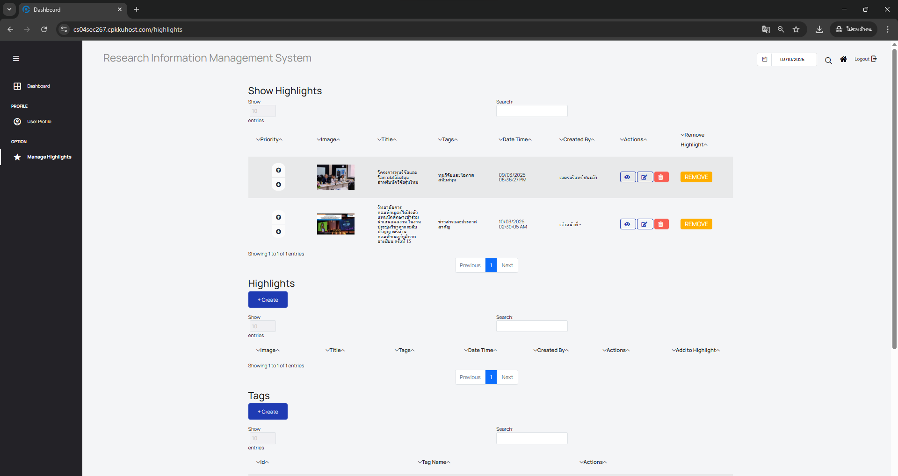  

   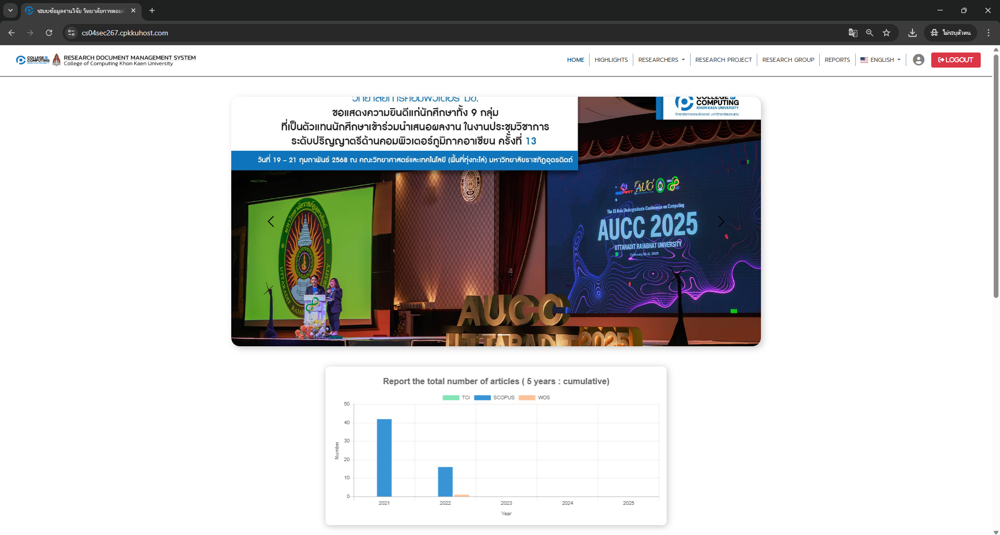

> **หมายเหตุ**: ตาราง Show Highlights สามารถมีไฮไลต์ได้สูงสุด 5 ไฮไลต์ หลังจากนั้นจะไม่สามารถคลิกปุ่ม **ADD** ได้  

---

### **5. การนำ Highlight ออกจากหน้า Home**

1. คลิกปุ่ม **REMOVE** ที่ช่อง Remove Highlight ของไฮไลต์บนตาราง Show Highlights ที่ต้องการนำออกจากหน้า Home  

   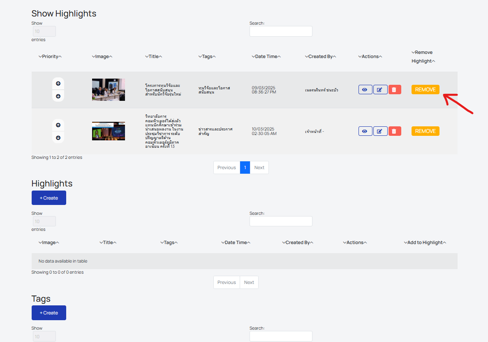

2. จากนั้นไฮไลต์นั้นจะย้ายจากตาราง Show Highlights ไปอยู่บนตาราง Highlights และไม่แสดงบนหน้า Home  

   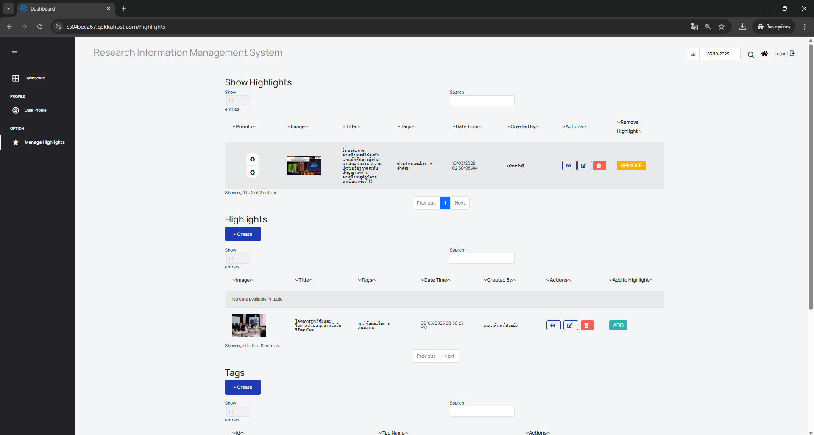  

   

---

### **6. การเรียงลำดับ Highlight ที่แสดงบนหน้า Home**

1. คลิกลูกศร ขึ้น(⭡) ลง(⭣) ที่ช่อง Priority ของไฮไลต์บนตาราง Show Highlights  

   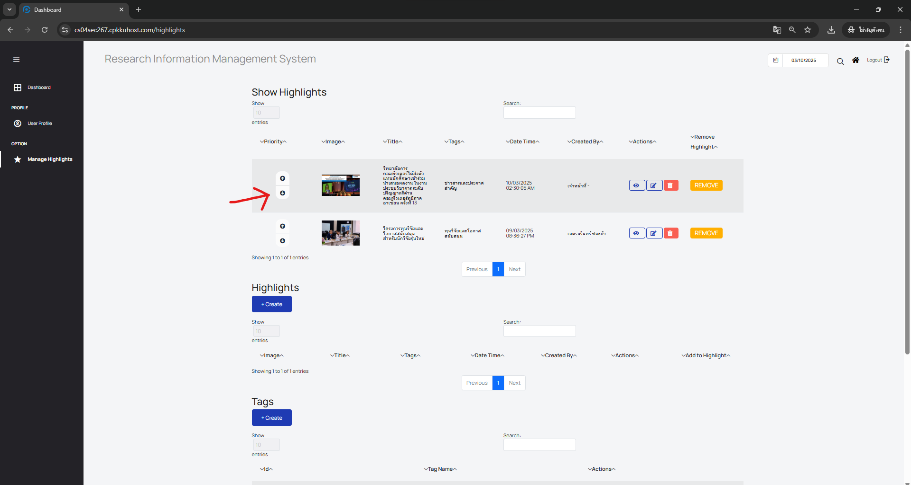

> ไฮไลต์ที่อยู่ด้านบนสุดจะแสดงเป็นลำดับแรกบนหน้า Home และเรียงลงมาตามลำดับ  

---

### **7. การเพิ่ม Tag**

1. คลิกปุ่ม **+Create** ใต้ **Tags** เพื่อสร้างแท็กใหม่  

   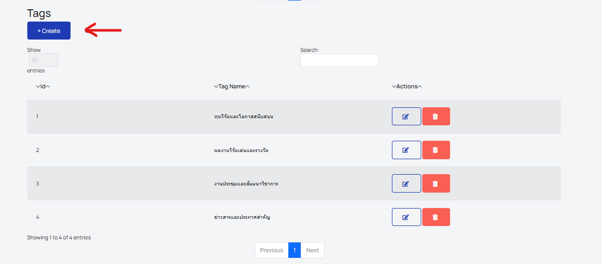

2. เมื่ออยู่ที่ป็อบอัพ "Create Tag" จะให้กรอก **Tag Name**  
3. คลิกปุ่ม **Save** เพื่อสร้างแท็ก จากนั้น Tag ที่สร้างเสร็จแล้วจะแสดงที่ตาราง Tags  

   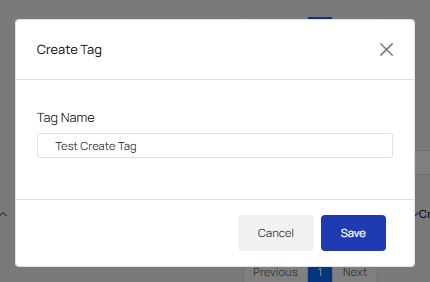
